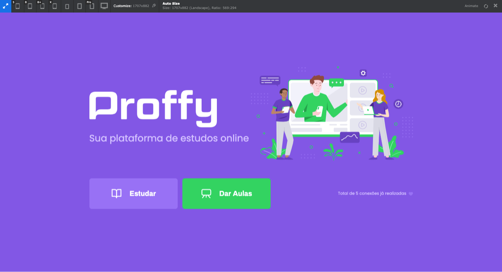

# Proffy - Aplicação Web responsiva

<p align="center">
   
</p>

O Projeto Next Level Week  #2 é um projeto realizado pela [Rocketseat](https://rocketseat.com.br/) que visa aprimorar os conhecimentos de desenvolvimento Web dos participantes, ajudando-os a atingir novos níveis de conhecimento técnico. 

O projeto de estudo dessa semana foi a plataforma de estudos Online Proffy. A plataforma  visa conectar alunos aos professores de acordo com a disciplina ofertada pelos professores e horários/dias disponíveis.

**[Veja a apresentação do projeto](https://github.com/luismigsantana/Proffy)**

## Responsividade 
Seguindo o conceito de mobile first a plataforma web foi toda pensada na responsividade.

**Plataforma Web em dispositivo Mobile**


**Home**


**Dar Aulas**


**Estudar**


## Rode na sua Máquina
Clone o projeto e em seguida use os comandos:

**Yarn**

```bash
yarn install
```

```bash
yarn start
```
